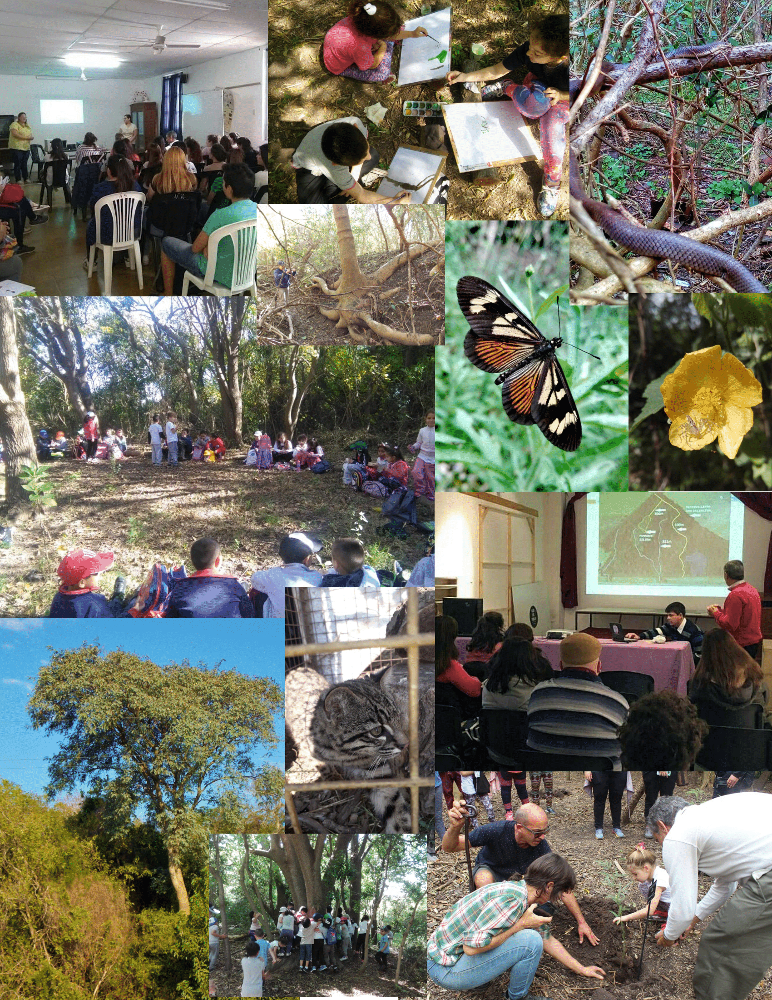

---
hide:
  - navigation
  - toc
---

### Material audiovisual de divulgación científica sobre aspectos ecológicos relevantes en la Reserva Alberdi. Este video se presentó en la Feria de Ciencia y Tecnología del 10 de Octubre de 2023 en la ciudad de Villaguay.

    <iframe width="800" height="500" src="https://www.youtube.com/embed/9IAFtBuWIxA?si=UREo9cSXhDmLJ0bk" title="YouTube video player" frameborder="0" allow="accelerometer; autoplay; clipboard-write; encrypted-media; gyroscope; picture-in-picture; web-share" referrerpolicy="strict-origin-when-cross-origin" allowfullscreen></iframe>

### Collage de fotos tomadas durante diversas actividades realizadas en la Reserva Alberdi.
### Año 2019

### Collage de fotos tomadas durante diversas actividades realizadas en la Reserva Alberdi.
### Año 2020
